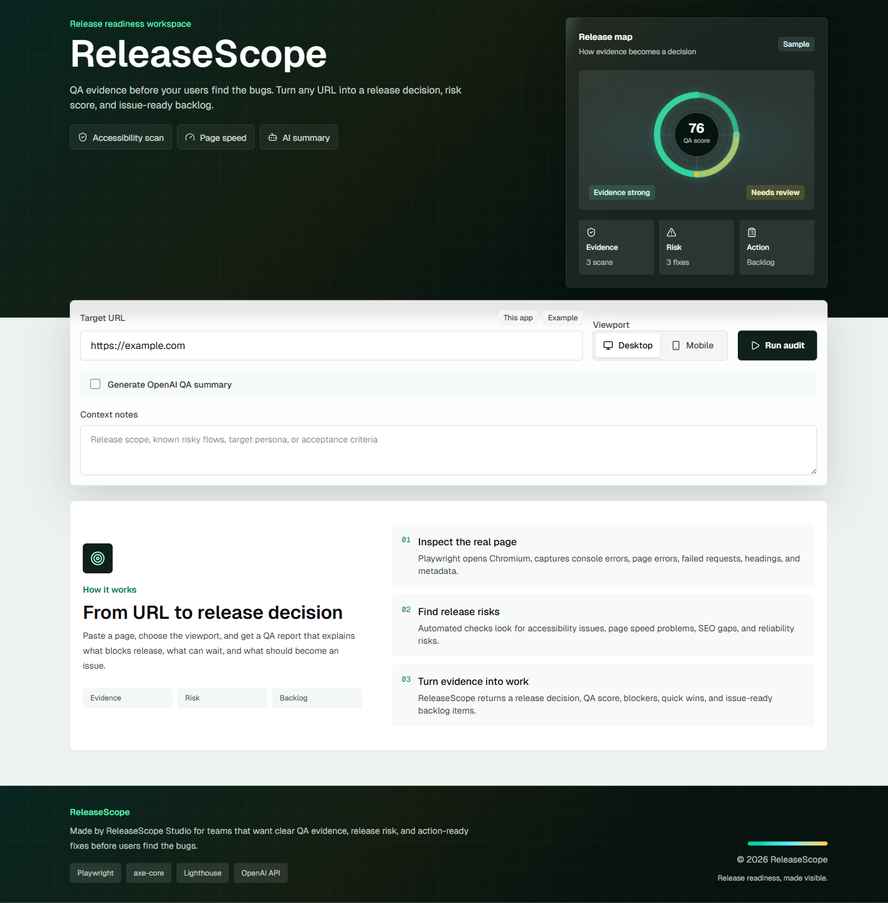
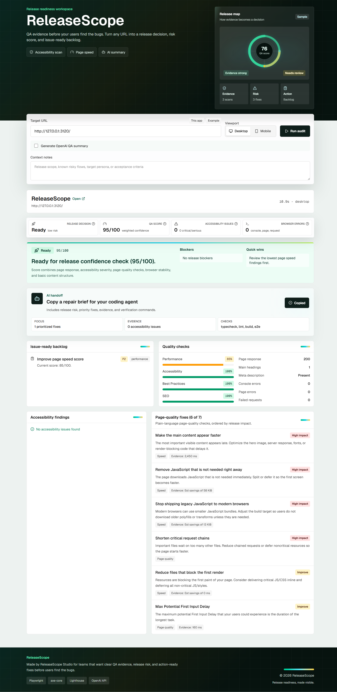

# ReleaseScope

ReleaseScope is an AI release-readiness platform for web teams. It opens a target URL with Playwright, checks accessibility with axe-core, scores page quality with Lighthouse, and turns the evidence into a release decision, QA score, and issue-ready backlog.

The long-term product direction is a scalable release command center for developers, QA engineers, support engineers, and small SaaS teams: CI checks, GitHub PR comments, public audit reports, AI repair briefs, release notes, and EU-focused accessibility/compliance packs.

The product is designed to feel like a real QA command center: clear empty states, loading feedback, responsive report layouts, plain-language findings, and a custom Release map visual in the header.

## Product Docs

- [Product vision](docs/product-vision.md)
- [Architecture](docs/architecture.md)
- [AI QA copilot](docs/ai-copilot.md)
- [CLI](docs/cli.md)
- [GitHub Actions](docs/github-actions.md)

## Preview

Run it locally and open [http://127.0.0.1:3000](http://127.0.0.1:3000).

```bash
npm install
npm run playwright:install
cp .env.example .env.local
npm run dev
```

## Screenshots



Empty state with the audit form, release map, and clear explanation of how evidence becomes a release decision.



Generated audit report with release decision, QA score, issue-ready backlog, page-quality fixes, and AI handoff prompt.

## What It Does

- Produces a release decision: `ready`, `needs review`, or `blocked`
- Calculates a weighted QA score from runtime, accessibility, Lighthouse, and content signals
- Runs a deterministic demo report for portfolio reviews without relying on external network calls
- Builds an issue-ready backlog with priorities and evidence
- Translates technical Lighthouse checks into plain-language page-quality fixes
- Copies an AI-ready repair brief for coding agents, including evidence and verification commands
- Shows polished empty, loading, success, warning, and error states
- Supports desktop and mobile viewport audits
- Optionally generates an OpenAI QA summary when `OPENAI_API_KEY` is configured
- Runs from the command line and writes CI-ready JSON, Markdown reports, PR comments, screenshots, traces, Lighthouse JSON, and axe reports

## Why It Matters For Teams

ReleaseScope gives product and engineering teams a shared release signal before a change reaches users. Developers get reproducible evidence, QA gets prioritized checks, support gets handoff notes, and product owners get a clear answer to the question: can this release ship now, or does it need review?

## Product Roadmap

ReleaseScope is designed to expand as a product ecosystem:

- **ReleaseScope Cloud**: project dashboard, release history, team ownership, trend charts, and shareable audit reports
- **ReleaseScope CLI**: `node bin/release-scope.mjs audit https://example.com` for local and CI usage
- **ReleaseScope GitHub Action**: audit preview deployments and comment release risk directly on pull requests
- **ReleaseScope Browser Extension**: connect manual page inspection with the cloud dashboard
- **AI QA Copilot**: generate edge cases, regression plans, issue descriptions, support handoff notes, and release notes
- **EU Compliance Packs**: WCAG, GDPR/cookie checks, security headers, privacy-policy checks, and SaaS launch readiness

## Automation QA Coverage

Playwright covers the main user-facing paths:

- Product smoke check and axe-core accessibility scan
- Browser-native URL validation before the API is called
- Loading state while an audit is running
- Release decision, backlog, tooltips, and page-quality findings with mocked API data
- AI repair brief copy flow with clipboard verification
- Mobile regression check for the page-quality list, including no nested scroll box
- Visible error state for API failures
- API validation for malformed requests and invalid JSON

CI runs `npm audit --omit=dev`, typecheck, lint, production build, and Playwright tests on desktop and mobile Chromium. Failed runs keep the Playwright HTML report, traces, screenshots, and videos as GitHub Actions artifacts.

Shared sample fixture for demos/tests: [`src/lib/qa/fixtures/sample-report.ts`](src/lib/qa/fixtures/sample-report.ts).

## CLI and CI

```bash
node bin/release-scope.mjs audit https://example.com \
  --json \
  --output releasescope-artifacts/audit.json \
  --artifact-dir releasescope-artifacts \
  --fail-on review
```

The CLI can emit Markdown for humans, JSON for CI, and a PR-ready release risk comment. See [CLI](docs/cli.md) and [GitHub Actions](docs/github-actions.md).

## Stack

- Next.js App Router + TypeScript
- Playwright browser automation
- axe-core accessibility checks
- Lighthouse performance, accessibility, best practices, and SEO scoring
- OpenAI Responses API for QA summaries
- GitHub Actions CI/CD validation

## Environment

Set `OPENAI_API_KEY` in `.env.local` to enable the AI summary panel. Without it, the audit still runs and marks the OpenAI summary as skipped.

Set `ALLOW_PRIVATE_AUDIT_TARGETS=true` only in trusted local or staging QA environments when auditing localhost or private network URLs. Production defaults block private targets.

## Scripts

```bash
npm run dev
npm run typecheck
npm run lint
npm run build
npm run cli
npm run cli:audit -- https://example.com -- --json
npm run test:e2e
npm run test:e2e:headed
npm run test:e2e:report
npm run qa:ci
```

## Notes

The audit endpoint launches local Chromium and is intended for local development, CI, or a Node host with browser dependencies available. It is not shaped as a serverless-only endpoint yet.
