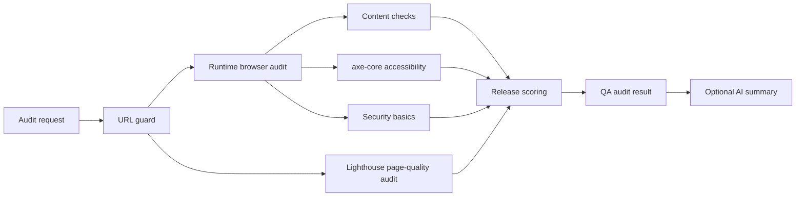

# ReleaseScope Architecture

ReleaseScope is organized around one core workflow: turn a target URL into a release-readiness result with evidence, scoring, and next actions.

The current architecture keeps the product small, but separates the audit engine into modules that can grow toward a CLI, GitHub Action, and cloud dashboard later.

## Audit Pipeline

## API Layer

The API route at `src/app/api/audits/route.ts` accepts an audit request, validates it with Zod, runs the QA audit, optionally adds an OpenAI summary, and validates the response shape before returning JSON.

The route stays intentionally thin. Business rules live in the QA engine, not in the Next.js route.

## Core Engine

The public entry point is `runQaAudit()` in `src/lib/qa/audit.ts`.

It coordinates:

- URL safety checks through `url-guard.ts`.
- Browser runtime collection through `engine/runtime.ts`.
- Content structure checks through `engine/content.ts`.
- Accessibility checks through `engine/accessibility.ts`.
- Lighthouse scoring through `engine/lighthouse.ts`.
- Basic security signal checks through `engine/security.ts`.
- Release decision and score explanation through `assessment.ts`.

This split keeps the audit pipeline readable and makes each signal source testable without turning the main audit function into a large procedural script.

## Typed Models

Shared TypeScript contracts live in `src/lib/qa/types.ts`. Zod schemas live in `src/lib/qa/schemas.ts`.

Important model groups:

- `QaAuditRequest` describes the incoming audit request, including `demoMode` and optional `scoringWeights`.
- `QaAuditResult` describes the full response consumed by the UI.
- `AuditEvidence` gives every major finding a structured evidence object with optional selector, URL, screenshot reference, raw tool output, and reproduction notes.
- `AuditSeverity` is stable across the product: `info`, `low`, `medium`, `high`, `critical`.
- `AuditFindingCategory` keeps finding areas consistent across accessibility, runtime, reliability, performance, SEO, content, security, and best practices.

## Scoring Model

ReleaseScope starts from a score of 100 and subtracts weighted penalties for risk signals.

The default weights live in `src/lib/qa/scoring-config.ts`. They can be overridden per audit request through `scoringWeights`, which lets future CLI, CI, or cloud workflows tune release gates for different teams.

The assessment returns:

- `score`, `decision`, and `riskLevel`.
- `blockers` for hard release concerns.
- `quickWins` for small improvements.
- `issueBacklog` with priority, category, severity, and evidence.
- `decisionReasons` explaining why the release is ready, needs review, or is blocked.
- `scoreExplanation` showing the weighted score drivers.

## Demo Mode

`demoMode` returns a synthetic audit result from `src/lib/qa/fixtures/demo-audit.ts` without external network calls.

This is useful for:

- UI demos.
- Local development when network access is unreliable.
- Stable tests and screenshots.
- Portfolio walkthroughs that need predictable evidence.

Demo mode still runs through the same scoring and Zod result validation, so it exercises the same product contract as live audits.

## Testing Strategy

The Phase 2 unit tests live in `src/lib/qa/assessment.test.ts` and run with Vitest.

They cover:

- A clean page resolving to `ready`.
- Critical accessibility and runtime evidence resolving to `blocked`.
- Configurable scoring weights changing the score.
- Demo mode producing a schema-valid audit result.

End-to-end Playwright tests continue to cover the main UI and API behavior.
